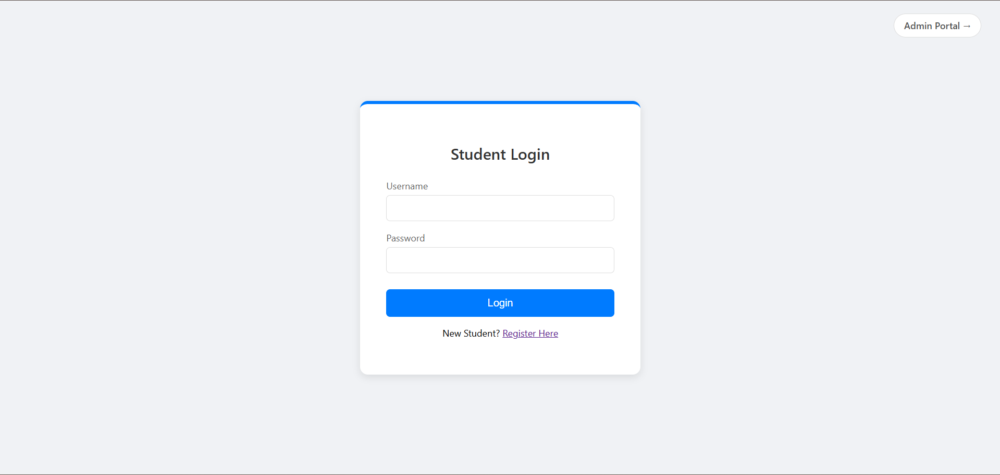
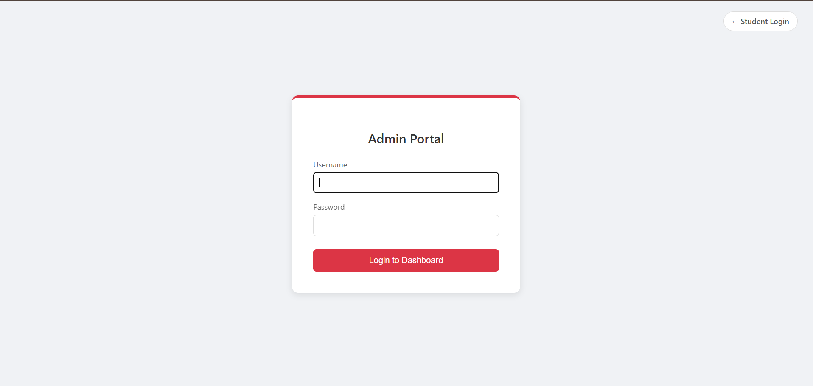
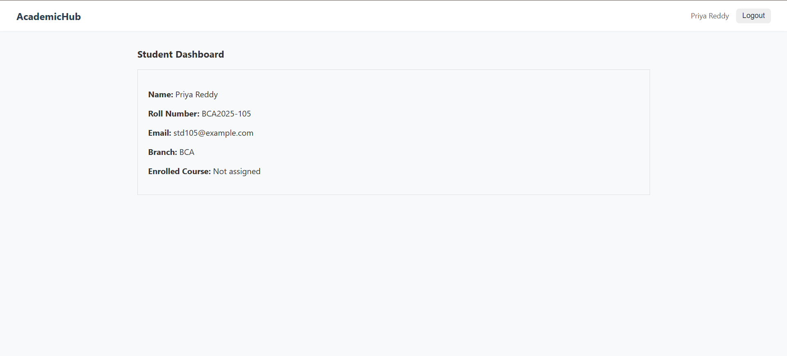
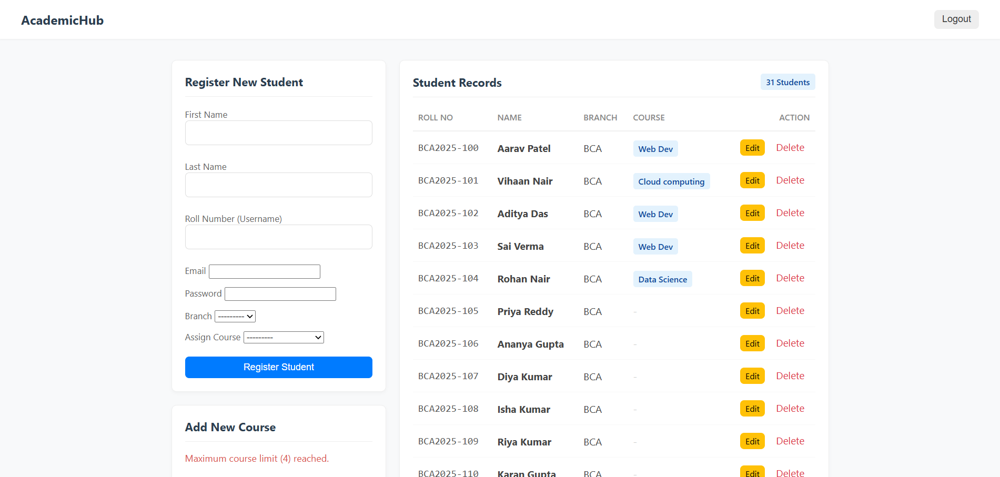

# AcademicHub - Student Management System

AcademicHub is a clean, efficient, and secure Student Management System built with **Django (Python)**. It facilitates seamless interaction between Administrators and Students, allowing for efficient management of academic records, courses, and student profiles.

---

## Screenshots

### 1. Login Page (Student & Admin Portal)

### 2. Student DashBoard

### 2. Admin Dashboard (Manage Students & Courses)

---

## Key Features

### Role-Based Authentication
* **Smart Login System:** Single interface with a toggle for Student vs. Admin portals.
* **Secure Access:** Restricted views based on user roles (Admins see management tools, Students see personal data).

### Admin Capabilities
* **CRUD Operations:** Create, Read, Update, and Delete student records.
* **Course Management:** Add and delete academic courses (limit of 4 active courses).
* **Quick Registration:** Register new students directly from the dashboard without using the command line.

### Student Features
* **Personal Dashboard:** View enrolled course, branch, roll number, and personal details.
* **Secure Profile:** Read-only access to ensure data integrity.

---

## Tech Stack

* **Backend:** Python, Django
* **Database:** SQLite (Default Django DB)
* **Frontend:** HTML5, CSS3 (Minimalist Custom Design)
* **Authentication:** Django Auth System

---

## Installation & Setup

Follow these steps to run the project locally.

### 1. Prerequisites
Ensure you have Python installed.
check with :
python --version

### 2. Install Django

pip install django

### 3. Initialize the Database

python manage.py makemigrations
python manage.py migrate

### 4. Create an Admin Account

python manage.py createsuperuser

### 5. Generate Dummy Data (Optional

python manage.py seed_data

### 6. Run the Server

python manage.py runserver

Access the application at: http://127.0.0.1:8000/

## Login Credentials

Admin Login
URL: Click "Admin Portal" on the login page.

Username: (The one you created in Step 4)

Password: (The one you created in Step 4)

Student Login (Dummy Data)
Username (Roll No): BCA2025-100 (Ranges from 100 to 129)

Password: password123

## Project Structure

academichub/
│
├── manage.py             # Django Command Utility
├── db.sqlite3             # Database File
├── academichub/        # Project Settings & Config
│
└── students/                 # Main Application
    ├── models.py           # Database Tables (Student, Course)
    ├── views.py           # Logic & Controllers
    ├── urls.py             # Route definitions
    ├── forms.py            # Registration & Edit Forms
    │
    ├── management/
    │   └── commands/
    │       └── seed_data.py # Script to generate dummy data
    │
    └── templates/students/ # HTML Files
        ├── login.html
        ├── dashboard_admin.html
        └── dashboard_student.html
